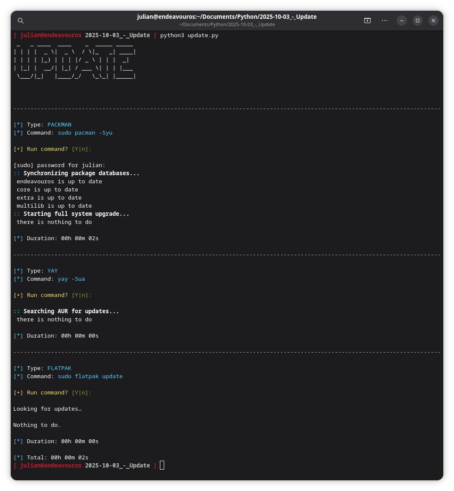

# ArchLinuxUpdate

## Screenshot


## Description
This tool written in python is for installing updates from pacman, yay and flatpak. Flatpak has to be installed. If not please remove or comment the ```update("sudo flatpak update", "FLATPAK")``` function call.

## Requirements
- colorama (sudo pacman -S python-colorama)
- pyfiglet (suod pacman -S python-pyfiglet)

## Platform
- Arch based Linux
